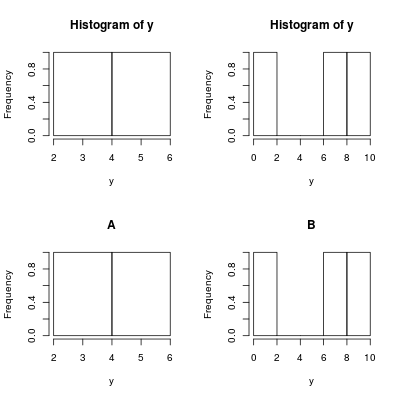

```{r,echo=FALSE,results='hide',error=FALSE,warning=FALSE}
library(data.table)
```


# Introduction


## what?

Extension of Data.frame
i.e. is.data.frame(DT) == TRUE

 - Think data.table as a set of columns
 - Every column is the same length but different type

```{r}
```


## why?


 - Reduce programming time, fewer function calls, less variable name repetition
 - Fast aggregation of large data (e.g. 100GB in RAM), fast ordered joins, fast add/modify/delete of columns by group using no copies at all, list columns 
 - Fast file reader (fread). 
 - Offers a natural and flexible syntax, for faster development.

```{r}
```


# how?
```{r}
```
## General Form

mtcarsDT[  
<span class="blue">
  mpg > 20
</span>,  
<span class="green">
  .(Avgmean = mean( hp ),
    "minWT(kg)"= min( wt*453.6 ))
</span>,  
<span class="yellow3">
by =.(cyl,under5gear = gear < 5 )
</span>  
]

<div class="columns-2">


<div class="columns-2">
R:  
SQL:  


<span class="blue"> i </span>  
<span class="blue"> where </span>  


</div>  


<div class="columns-2">
<span class="green"> j </span>  
<span class="green"> select </span>  


<span class="yellow3"> by = </span>  
<span class="yellow3"> group by </span>  


</div>


</div>

## Example

Take <span class="black"> mtcarsDT </span>, subset using <span class="blue"> i </span>, then calculate <span class="green"> j </span> grouped by <span class="yellow3"> by </span>

```{r Readed}
mtcarsDT <- as.data.table(mtcars)
mtcarsDT[
  mpg > 20,
  .(Avgmean = mean( hp ),
    "minWT(kg)"= min( wt*453.6 )),
  by =.(cyl,under5gear = gear < 5 )
  ]
```

## Create

```{r Create}
DT <- data.table( A = 1:6 , B = c("a","b","c") ,
                  C = rnorm(6) , D = TRUE )
DT
```

## Print

```{r Print}
DT2 <- data.table( A = 1:1000000 , B = letters[1:20] ,
                   C = rnorm(1000000) , D = TRUE)
DT2
```

## Subseting

<div class="columns-2">

```{r SubsetingA}
DT[ 3:5 , ] # or DT[ 3:5 ]
```

```{r SubsetingB}
DT[ B == "a" ]
```
<br>
```{r SubsetingD}
DT[ B %in% c("a","c") ]
```

```{r SubsetingE}
DT[ between(C,-0.5,0.5) ]
```

</div>

## Selecting columns

```{r selecting}
DT[, .(B, C)]
```

NB: .() is an alias to list() in
data.tables and they mean
the same.

## Computing on columns

<div class="columns-2">
<span>
```{r ComputingA}
DT
```
</span>


<span>
```{r ComputingB}
DT[, .(Total = sum(A),
       Mean = mean(C))]

DT[, .(paste0(B,collapse=""))]
```
  
</span>
</div>

## Recycling
```{r Recycling}
DT[, .(B,C=sum(C))]
```

## Assignments (:=)

```{r  assignments}
DT2[ , c("mean_A","sum_c"):=list(mean(A),sum(C)) ,by=B ]
DT2
```

## Delete

```{r  Delete,warning=TRUE}
DT2[ , sum_c:=NULL ]
DT2
```

## Throw anything
```{r Throw_anything}
DT[, plot(A,C)]
```

## Anything!!!
```{r Throw_anything_2}
DT[, { print(A)
       hist(C)
       NULL}]
```


## Group By

<div class="columns-2">
```{r Group_By1}

(DT <- data.table( 
  A = c("c","a","b") ,
  B =1:6 ))
```

```{r Group_By2}
DT[,.(MySum = sum(B),
      MyMean = mean(B)),
   by =.(A)]
```
<br><br>
</div>

## Group By

Functions on by stament

<div class="columns-2">
```{r Group_By3}

(DT <- data.table( 
  A = 1:5 ,
  B =10:14 ))
```

```{r Group_By4}
DT[,.(MySum = sum(B)),
   by =.(Grp =A%%2)]
```
<br><br>
</div>


## Group By

$.( )$ is not necesari if we don't care about output column names

Also we can subset the aggregation

<div class="columns-2">
```{r Group_By5}
DT[,sum(B),by =A%%2]
```

```{r Group_By6}
DT[2:4,sum(B),by =A%%2]
```
</div>

<span class="red"> Attention: </span>   ordered by order of appearance which comes in the original data.table


## Symbols

All symbols (.N,.SD,.I,.BY,.GRP,.EACHI)

<div class="columns-2">
X

| x | y |
|---|---|
| A | 2 |
| A | 5 |
| B | 7 |
| B | 1 |
| B | 9 |

Y

| z | n |
|---|---|
| A | 1 |
| B | 2 |

<br><br><br><br><br>

</div >

## .N

```{r symbolsN}
X <-  data.table(x=c("A","A","B","B","B"),y=c(2,5,7,1,9),key="x")
Y <-  data.table(z=c("A","B"),n=c(1,2),key="z")
X[,.N,by=x]
```

## .SD

"Subset of Data.table"

```{r symbolsSD}
X[,print(.SD),by=x]
```

## .I
index of DT (or wich?)
```{r symbolsI}
X[x=="A",.I]
X[x=="B",.I]
X[,.I[x=="B"]]
```


## .BY

```{r symbolsBY ,eval=FALSE}
X[,.(hist(y)),by=x]
X[,.(hist(y,main=paste(.BY))),by=x]
```



## .EACHI

```{r symbolsEACHI}
X[Y,head(.SD,n),by=.EACHI]
```


##Programatically vary by
```{r bys}
DT <- data.table(x=c("B","A","B","A","B"),y=c(7,2,1,5,9))
bys = list ( quote(y%%2),
 quote(x),
 quote(y%%3) )

for (this in bys)
 print(DT[,sum(y),by=eval(this)])
```


##Programatically vary selection get()

```{r  get}
DT$x
DT[,x]
DT[,get("x")]
```

##Programatically vary selection  with=F

<div class="columns-2">
```{r  with_FALSE1}
DT[,"x"] 
DT[,"x",with=F]

```

```{r  with_FALSE2}
DT[,1]
DT[,1,with=F]
```
</div >


##Sort
The 3rd highest voted [R] question (of 43k):

How to sort a dataframe by column(s) in R (*)


```{r sort1,echo=FALSE}
DF <- as.data.frame(DT2)
```

```{r  sort2}
system.time( { DF[ with(DF, order(-C, B)), ] } )
```
- vs -
```{r  sort3}
system.time( { DT2[ order(-C, B) ] } )
```


## Performance

```{r  perfornamce1,results='hide',error=FALSE,warning=FALSE,message=FALSE}
library(dplyr)
```
```{r  perfornamce2,results='hide',error=FALSE,warning=FALSE}
N=2e7; K=99
DT <- data.table(
  id1 = sample(sprintf("i%03d",1:K), N, TRUE),    # large groups (char)
  id2 = sample(sprintf("i%03d",1:K), N, TRUE),    # large groups (char)
  id3 = sample(sprintf("i%06d",1:(N/K)), N, TRUE), # small groups (char)
  id4 = sample(K, N, TRUE),                     # large groups (int)
  id5 = sample(K, N, TRUE),                     # large groups (int)
  id6 = sample(N/K, N, TRUE),                   # small groups (int)
  v1 =  sample(5, N, TRUE),                     # int in range [1,5]
  v2 =  sample(5, N, TRUE),                     # int in range [1,5]
  v3 =  sample(round(100*runif(100),4), N, TRUE))# numeric e.g. 23.5749
DF <- as.data.frame(DT)
```

```{r  perfornamce3}
cat("GB =", round(object.size(DT)/1073741824, 3), "\n")
```


## Char groups {.smaller}

<div class="columns-2">

Large groups

```r
  DT[, sum(v1), keyby="id1,id2"]
```

```{r  lgc_dt2,echo=FALSE}
system.time( DT[, sum(v1), keyby="id1,id2"] )
```

```r
  DF %>% group_by(id1,id2) %>% 
    summarise(sum(v1))
```

```{r  lgc_dplyr,echo=FALSE}
system.time( DF %>% group_by(id1,id2) %>% 
               summarise(sum(v1)) )
```

Small groups
```{r  sgc_dt1,eval=FALSE}
  DT[, list(sum(v1),mean(v3)), keyby=id3]
```
```{r  sgc_dt,echo=FALSE}
system.time( DT[, list(sum(v1),mean(v3)), keyby=id3] )
```

```{r  sgc_dplyr1,eval=FALSE}
  DF %>% group_by(id3) %>%
    summarise(sum(v1),mean(v3))
```
```{r  sgc_dplyr,echo=FALSE}
system.time( DF %>% group_by(id3) %>% 
               summarise(sum(v1),mean(v3)))
```

</div >

## Integer groups {.smaller}

<div class="columns-2">

Large groups
```{r  lgi_dt1,eval=FALSE}
  DT[, lapply(.SD, mean), keyby=id4, 
   .SDcols=7:9] 
```
```{r  lgi_dt,echo=FALSE}
system.time( DT[, lapply(.SD, mean), keyby=id4, .SDcols=7:9] )
```

```{r  lgi_dplyr1,eval=FALSE}
  DF %>% group_by(id4) %>% 
    summarise_each(funs(mean), 7:9) 
```
```{r  lgi_dplyr,echo=FALSE}
system.time( DF %>% group_by(id4) %>%
               summarise_each(funs(mean), 7:9) )
```

Small groups

```{r  sgi_dt1,eval=FALSE}
  DT[, lapply(.SD, sum), keyby=id6, 
   .SDcols=7:9] 
```
```{r  sgi_dt,echo=FALSE}
system.time( DT[, lapply(.SD, sum), keyby=id6, .SDcols=7:9] )
```

```{r  sgi_dplyr1,eval=FALSE}
 DF %>% group_by(id6) %>% 
  summarise_each(funs(sum), 7:9)
```
```{r  sgi_dplyr,echo=FALSE}
system.time( DF %>% group_by(id6) %>% 
               summarise_each(funs(sum), 7:9) )
```

</div >


## set functions

In data.table, all set* functions change their input by reference.The only
other data.table operator that modifies input by reference is :=.
No copy is made other than temporary working memory, which is as large as one column

* setattr()
* setnames()
* setcolorder()
* setkey()
* setkeyv()
* setDT()
* setorder()

## copy() {.smaller}

<div class="columns-2">

```{r  no_copy}
 DT  <- data.table(x=c(1,2),y=c(3,4))
 DT2 <- DT
 DT[,x:=c(5,6)]
 DT
 DT2
```

```{r  copyh}
 DT  <- data.table(x=c(1,2),y=c(3,4))
 DT2 <- copy(DT)
 DT[,x:=c(5,6)]
 DT
 DT2
```
</div>


#other cool staff

list column example
data.table(
 x = letters[1:3],
y = list( 1:10,
letters[1:4],
data.table(a=1:3,b=4:6)
))
x y
1: a 1,2,3,4,5,6,
2: b a,b,c,d
3: c <data.table>

```{r}
```


```{r}
```

## Slide with Plot

```{r, echo=FALSE}
```

# References

***

  - [datacamp](https://www.datacamp.com/courses/data-analysis-the-data-table-way)
  - [user2014](http://user2014.stat.ucla.edu/files/tutorial_Matt.pdf)
  - [benchmarks](https://github.com/Rdatatable/data.table/wiki/Benchmarks-%3A-Grouping)
  - [Pakage pdf](https://cran.r-project.org/web/packages/data.table/data.table.pdf)
  - [Pakage wiki](https://github.com/Rdatatable/data.table/wiki)
  - [Slides](https://github.com/jpuigde/Rdatatable)

